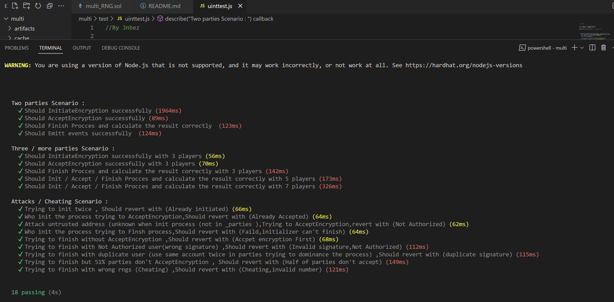

# Multi_RNG Smart Contract
The multi_RNG smart contract is a decentralized application (dApp) that allows multiple parties to interact and generate fair random numbers that can be used for gambling or other purposes. Using advanced cryptographic techniques, the contract ensures that each party contributes equally to the generation of the random number and that no single party can influence the outcome.

# Features
- Allows one party to initiate an encryption process with a specified ID, list of parties, encryption value, lower bound, and upper bound.
- Ensures that at least half of the parties accept the encryption process before proceeding to the next step.
- Allows parties to reveal their coefficients and random numbers to the rest of the group.
- Ensures that the final result is calculated using a weighted average of the inputs from all parties.
- Provides a mechanism for withdrawing funds from the contract.

# Usage

To use the Mult smart contract, you can call its functions using the following steps:

1.Initiate an encryption process by calling InitiateEncryption with the required parameters including the ID of the process, addresses of the parties involved, encryption value, lower bound, and upper bound. Only one party needs to initiate the process.

2.Each party have to accept the encryption process by calling AcceptEncryption with the ID of the process and their assigned encryption value. If less than half of the parties have accepted the encryption, you should wait until at least half have accepted before proceeding to the next step.

3.Each party can then reveal their coefficients and random numbers by calling Finish_Procces with the ID of the process, their coefficients, random numbers, and signatures of all parties involved.

4.The final result is calculated using all inputs from the parties and verified to be a fair random number.

5.Funds can be withdrawn from the contract by calling withdraw with the specified amount.

# Running unit tests

To run the Mult smart contract unit tests using Hardhat, follow these steps:

1. Clone or download the repository to your local machine.
2. Open a terminal window and navigate to the project directory.
3. Run npm install to install the required dependencies.
4. To run the unit tests, run npx hardhat test.
5. You should see the test results in your terminal window.

# Contributing
Contributions to the Mult smart contract are welcome. To contribute, you can fork the project, make your changes, and submit a pull request. Please ensure that your changes follow the coding standards and do not introduce any vulnerabilities or bugs.

## Contract Address
It deployed to the Testnet Mumbai network. The contract's address is:

- Network: Testnet Mumbai
- Blockchain: Polygon
- Contract Address: 0x06CfF43960Fc1020258Bd6CF0D70b8eBA1360b39
- Check out t on the Mumbai Polygon Network: <a href="https://mumbai.polygonscan.com/address/0x06CfF43960Fc1020258Bd6CF0D70b8eBA1360b39">0x06CfF43960Fc1020258Bd6CF0D70b8eBA1360b39</a>

# Authors
The Mult smart contract was developed by Jnbez.

# License
This smart contract is provided under the MIT license. See LICENSE.md for more information.
